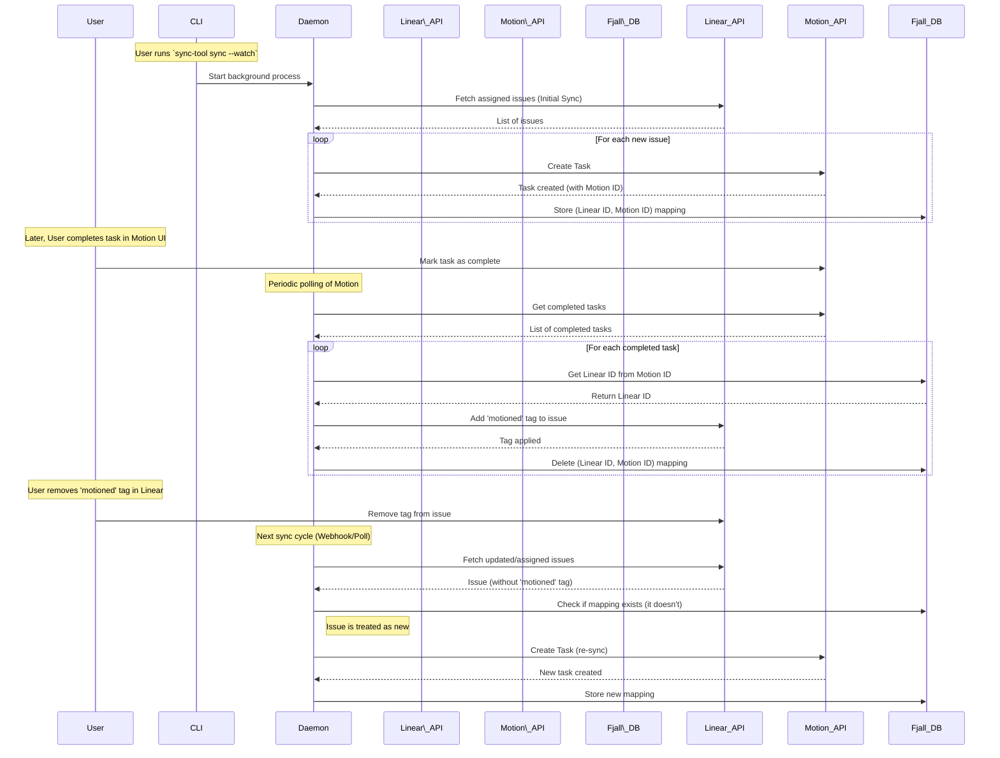

# Product Requirements Document: Linear-Motion Sync Tool

**Version:** 1.0

**Date:** September 7, 2025

**Author:** PRD Builder

## 1. Introduction & Overview

Developers who use Linear for team-based project management and Motion for personal task and calendar management currently spend significant manual effort keeping their work items synchronized between the two platforms. This process is time-consuming, error-prone, and leads to a disjointed view of their total workload.

The **Linear-Motion Sync Tool** is a command-line microservice designed to automate this process. It provides a robust, configurable, and fault-tolerant pipeline to sync Linear issues to a user's Motion calendar, ensuring that their personal to-do list accurately reflects their assigned work.

## 2. Goals & Objectives

* **Primary Goal:** To eliminate the manual effort required to synchronize assigned Linear issues with a personal Motion calendar.

* **Key Objectives:**

  * **Automate Task Creation:** Automatically create tasks in Motion based on issues assigned to the user in specified Linear projects.

  * **Provide Flexible Configuration:** Allow users to define multiple Linear sources, customize time estimate conversions, and set sync schedules.

  * **Ensure Bidirectional Status Updates:** Reflect task completion in Motion back to Linear by applying a specific tag, creating a closed-loop system.

  * **Maintain Reliability:** Implement fault tolerance and provide clear status reporting to ensure eventual consistency, even when APIs are temporarily unavailable.

## 3. Target Audience & User Personas

* **Primary User:** Individual software developers, engineers, or product managers.

* **Persona:**

  * Uses Linear as part of a development team for managing sprints, projects, and issues.

  * Uses Motion for personal time management, task scheduling, and calendar organization.

  * Is technically proficient and comfortable using command-line tools and editing JSON configuration files.

  * Values productivity and seeks to automate repetitive personal workflows.

## 4. User Stories & Use Cases

* **As a developer, I want to** configure the tool to watch specific Linear projects, **so that** only relevant work is synced to my personal calendar.

* **As a developer, I want to** have my Linear issue estimates automatically converted into task durations in Motion, **so that** my calendar blocks out the correct amount of time.

* **As a developer, I want** the tool to run continuously in the background, **so that** my Motion calendar is always up-to-date without my intervention.

* **As a developer, I want** tasks I complete in Motion to be automatically tagged in Linear, **so that** I don't have to update the status in two places and the tool knows not to sync them again.

* **As a developer, I want to** check the status of the sync process, **so that** I can see which issues are being tracked and identify any errors that have occurred.

* **As a developer, I want to** run a single, one-off sync, **so that** I can manually update my calendar without starting a background service.

## 5. Functional Requirements

### 5.1. Configuration

* The tool MUST be configured via a `config.json` file.

* An interactive `init` command (`sync-tool init`) MUST be provided to generate a template configuration file.

* The configuration MUST support:

  * A single Motion API key.

  * A list of one or more `sync_sources`, each representing a connection to a Linear workspace.

  * Global `sync_rules` that can be optionally overridden within each `sync_source`.

  * A default polling interval, with an optional list of schedule overrides for different times (e.g., "Work Hours").

### 5.2. Sync Logic: Linear to Motion

* The tool MUST be able to operate using either a **webhook** or **polling** strategy for each configured sync source.

  * If a `webhook_base_url` is provided for a source, the tool SHOULD attempt to automatically create and configure the necessary webhook in Linear.

* On startup, the tool MUST perform an initial, idempotent sync of all open issues assigned to the user from the configured Linear projects.

* When a new Linear issue is assigned to the user, a corresponding task MUST be created in Motion.

* If a Linear issue's details (e.g., title, estimate) are updated, the corresponding Motion task MUST be updated.

* Linear issue time estimates MUST be converted to Motion task durations based on the configured `time_estimate_strategy`. The tool MUST support strategies for Fibonacci, T-Shirt, and other estimation types used by Linear teams.

* If a Linear issue has no time estimate, a task MUST be created in Motion with a configurable `default_task_duration_mins`.

### 5.3. Sync Logic: Motion to Linear

* The tool MUST periodically poll Motion to check for tasks that have been marked as completed.

* When a synced task is marked as complete in Motion, the tool MUST apply a configured tag (e.g., `"motioned"`) to the corresponding issue in Linear.

* Once the tag is successfully applied, the mapping for this task MUST be removed from the local `fjall` database.

### 5.4. State & Deletion Logic

* When a Linear issue's status changes to "Done" or "Canceled", the corresponding task in Motion MUST be marked as complete. It MUST NOT be deleted.

* If the "completed" tag (e.g., `"motioned"`) is manually removed from an issue in Linear, the tool MUST treat it as a new item and re-create the task in Motion during the next sync cycle.

### 5.5. CLI Commands & Operation

* `sync-tool init`: Creates the `config.json` template.

* `sync-tool sync`: Performs a single sync run across all sources and then exits. Errors are printed inline to the console.

* `sync-tool sync --watch`: Starts the tool as a long-running daemon for continuous background syncing.

* `sync-tool status`: When the daemon is running, this command communicates with it via IPC to display the current state of all tracked issues and any associated errors from the `fjall` status table.

## 6. Non-Functional Requirements

* **Reliability & Fault Tolerance:** The tool must be resilient to API failures. An error syncing one source MUST NOT prevent other sources from being processed. Errors must be logged to the `fjall` status table for inspection.

* **Performance:** The tool must respect the API rate limits of both Linear and Motion. Polling intervals should be configurable to balance real-time updates with API usage.

* **Security:** API keys are to be stored in the `config.json` file. The user is responsible for securing this file via filesystem permissions.

* **Data Integrity:** The sync process must be idempotent to prevent duplicate task creation. The local database serves as the source of truth for ID mapping between systems.

## 7. Design Considerations & Technical Details

* **Local Database:** A local `fjall` database will be used to store mappings between Linear issue IDs and Motion task IDs. A separate table will be used to track the status and log errors for currently synced issues.

* **Concurrency:** The `fjall` database will be accessed by a single daemon process. The `status` CLI command will use an Inter-Process Communication (IPC) mechanism to request data from the daemon, avoiding concurrent database access issues.

* **Workflow Visualization:** The core logic of the sync process can be visualized with the following diagram.

### Mermaid Sequence Diagram

## 8. Success Metrics

* **Adoption:** The number of active users running the tool.

* **Reliability:** Low number of user-reported sync errors or inconsistencies.

* **Efficiency:** Reduction in time spent by users manually managing their tasks, measured qualitatively through user feedback.

* **API Usage:** The tool operates within the rate limits of both Linear and Motion APIs without causing throttling.

## 9. Open Questions & Future Considerations

* **Security Enhancement:** For a future release, consider integrating with OS-native credential managers (like macOS Keychain or Windows Credential Manager) for more secure storage of API keys.

* **Web UI:** Could a simple web interface be created for configuration and status monitoring as an alternative to the CLI?

* **Broader Platform Support:** Could this architecture be extended to support other project management (e.g., Jira, Asana) or task management (e.g., Todoist) tools?
